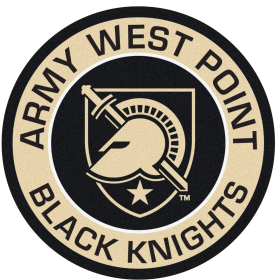

### Hello World 

Welcome to my gihub! My name is Nathan Peper and I love collaborating to pathfind, create, and build things that connect the physical and digital worlds for positive impact.
 

I'm currently the Head of Strategy and Business Innovation for the <a href="https://www.intel.com/health" target="_blank" style="color: #2C6BAC; font-weight: bold">Healthcare</a> team at Intel.

I love open-source and collaboration, but more importantly, I believe in failing fast and sharing lessons learned. My intentions for my GitHub and my other sites are that I can share lessons from my triumphs and my failures on the journey to becoming the next Iron Man...

 

 

I am a graduate of the Massachusetts Institute of Technology, where I earned both a <a href="https://aeroastro.mit.edu/" target="_blank" style="color: #2C6BAC; font-weight: bold">Master of Science in Aeronautics and Astronautics</a>, with a focus on complex system design, and a <a href="https://mitsloan.mit.edu/" target="_blank" style="color: #2C6BAC; font-weight: bold">Master of Business Administration</a>. With the increasing importance and potential for scalable impact of data, analytics, and AI, I also earned a Master of Information and Data Science from the <a href="https://datascience.berkeley.edu/" target="_blank" style="color: #2C6BAC; font-weight: bold">University of California, Berkeley</a>. I am also a graduate of the <a href="https://www.westpoint.edu/" target="_blank" style="color: #2C6BAC; font-weight: bold">United States Military Academy</a>, where I earned a Bachelor of Science in Mechanical Engineering with additional focus on Aeronautical Engineering.

  

 
 
 

## Let's connect!

 
 
 
